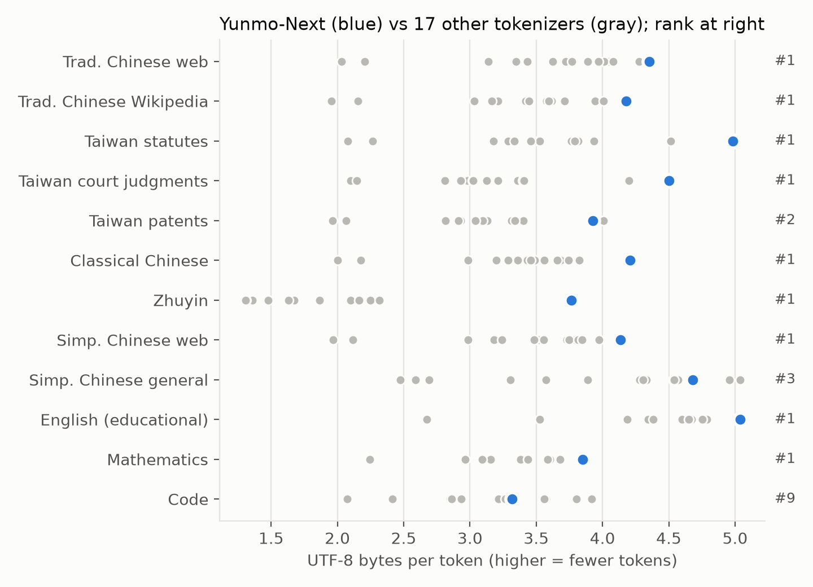

# The Yunmo-Next Tokenizer

*Technical report · Yunmo-Next-1B · October 2026*

## Summary

Yunmo-Next uses a 65,536-entry byte-level BPE tokenizer trained for Traditional Chinese, English, code and
mathematics. Two decisions shape it:

1. **The training corpus is sized by target token exposure, not by bytes.** Each domain's byte budget is
   chosen so that its share of *tokens* matches its planned share of model training, and the budget is
   recomputed with the new tokenizer until it stops moving.
2. **Vocabulary is built in two phases.** Phase 1 learns 60,280 entries within standard pre-tokenization
   boundaries with every digit isolated; phase 2 learns 5,000 additional "superwords" that may cross
   those boundaries. Both are serialized into one standard `tokenizer.json`.

On a blind held-out set it uses 6.5% fewer tokens than a phase-1-only control trained on the same data, and
a 91.9M-parameter model trained with it reached slightly lower bits per byte at an equal token budget
(one seed). Across 12 text domains and 18 tokenizers it needs the fewest tokens on 9 domains, including
every Traditional Chinese domain except patents; code is its weakest domain. Those domains overlap its own
training sources, which favors it (§6.3).

## 1. Goals and constraints

In order of priority, the tokenizer should:

1. help the downstream model learn, measured as bits per byte of a model trained at an equal token
   budget;
2. compress Traditional Chinese well without giving up English, code and mathematics, because a fixed
   token budget buys more text in a domain that encodes compactly;
3. be lossless and robust: any UTF-8 input round-trips, there is no UNK token, and digits are split one
   per token so numbers are read consistently;
4. reserve control IDs for chat, reasoning, tool calls and multimodal input from the start, so that later
   stages never resize the embedding matrix;
5. load with the standard `tokenizers` library.

The vocabulary size, 65,536, is fixed by the model: a 1,024-wide model ties its embedding and output head,
so every 1,000 entries cost about 1M parameters in a 1B model.

## 2. Corpus construction

### 2.1 Allocation by token exposure

Let `q_d` be the planned share of training tokens for domain `d` and `τ_d` the tokens per UTF-8 byte that
a reference tokenizer produces on it. The byte budget is

```text
b_d = (q_d / τ_d) / Σ_j (q_j / τ_j)
```

Domains that encode into many tokens per byte (Zhuyin, code) need fewer bytes to reach their token
share; domains that encode compactly need more. After training, `τ_d` is re-measured with the new
tokenizer and the budgets recomputed; the corpus would be rebuilt if any major domain's share moved by more
than 1 percentage point. The largest observed move was 0.73 points (English), so one iteration sufficed.

| Major domain | Planned token share | Byte share after re-measurement |
|---|---:|---:|
| Chinese (Traditional, converted Traditional, Simplified, Zhuyin) | 42.3% | 41.8% |
| English | 28.5% | 34.5% |
| Code | 16.3% | 12.4% |
| Mathematics | 12.8% | 11.3% |

### 2.2 Sources

The corpus draws from 21 source families. "Native" and "converted" Traditional Chinese are tracked
separately even though they look the same after conversion; converted text is Simplified Chinese passed
through OpenCC.

| Stratum | Sources | Train documents | Train bytes |
|---|---|---:|---:|
| Native Traditional Chinese | FineWeb2-HQ (native), Chinese Wikipedia (zh-tw), Wikisource, court judgments, statutes, regulations, patents | 7,914 | 31.4 MB |
| Traditional Chinese instructions | two public reasoning-instruction sets | 1,817 | 4.7 MB |
| Zhuyin | CNS11643 Mandarin phonetic data | 38,121 | 0.8 MB |
| Converted Traditional Chinese | FineWeb2-HQ (converted), Ultra-FineWeb-zh, OpenCSG FineWeb-Edu-zh | 7,990 | 32.2 MB |
| Simplified Chinese (kept as is) | Chinese Wikipedia (Simplified) | 14,239 | 13.8 MB |
| English | FineWeb-Edu, Ultra-FineWeb | 18,761 | 70.5 MB |
| Code | filtered source code | 7,310 | 25.0 MB |
| Mathematics | FineMath (4+, large), IndustryCorpus2 math (zh), Nemotron-CC-Math | 5,089 | 21.8 MB |
| **Total** | | **101,241** | **200.2 MB** |

### 2.3 Held-out set and filtering

A blind held-out set of 10,166 documents (20.1 MB) was selected *before* any tokenizer was scored, by
ranking documents with a hash of a fixed seed, the source name and the exact text. Held-out documents were
removed from every training source by exact content hash; no document appears in both splits.

Both splits passed a replayed filter for benchmark contamination (39,574 benchmark needles; 141 candidate
documents rejected), personal data and opt-out markers. No near-duplicate scan was run between the
splits; they are separated by exact hash only.

## 3. Algorithm

### 3.1 Phase 1: bounded BPE

Phase 1 is byte-level BPE over a regex pre-tokenizer with individual-digit splitting and the full byte
alphabet, producing 60,280 text entries (60,024 merges). Native Traditional Chinese documents are seen
twice in this phase only, raising their weight from 200.2 MB of unique text to 236.4 MB effective.

### 3.2 Phase 2: superwords

Phase 2 re-encodes each training document with the phase-1 tokenizer, maps each phase-1 ID to a private
symbol, and trains a second BPE over those symbol sequences. A new entry may span up to 8 phase-1 tokens.
Digits and line breaks end a candidate, so numbers and lines are never merged across. The pass processed
50.4M phase-1 tokens from all 101,241 documents and kept 5,000 new entries; 16 further merge events
re-created strings already in the vocabulary through a different merge path and add no embedding rows.

The two merge lists are translated back into ordinary byte-level BPE strings and written as one standard
`tokenizer.json`. The final pre-tokenizer keeps digit isolation but disables the word-boundary regex, which
is what lets phase-2 merges span spaces and punctuation at encode time.

This follows the cross-boundary idea of SuperBPE but is an independent implementation, not a reproduction
of SuperBPE or BoundlessBPE. Apart from digits and line breaks, it enforces no script or punctuation
boundary; a superword can mix scripts if that sequence was frequent in training.

### 3.3 Normalization

None. The tokenizer applies no Unicode normalization, script conversion, case folding or whitespace
cleanup; Traditional/Simplified conversion happens in the data pipeline, not in the tokenizer.

## 4. Protocol IDs

IDs 65,280–65,535 form a versioned protocol (`protocol_abi_v2.json`): 31 active control tokens and 225
reserved slots.

| Group | Tokens |
|---|---|
| Sequence | `<|bos|>` 65,280, `<|eos|>` 65,281, `<|pad|>`, `<|unk|>` |
| Messages | `<|start|>`, `<|channel|>`, `<|message|>`, `<|end|>`, `<|return|>`, `<|recipient|>`, `<|call|>` |
| Documents and code | `<|doc_start|>`, `<|doc_end|>`, `<|fim_prefix|>`, `<|fim_suffix|>`, `<|fim_middle|>`, `<|file_sep|>` |
| Transcripts | segment, speaker, timing and non-speech markers |
| Reserved aliases | image, audio input/output and voice-reference spans (65,311–65,322) |

Roles (`system`, `user`, `assistant`, `tool`) and channels (`analysis`, `final`) are ordinary text between
control tokens, not extra vocabulary. The protocol tokens are registered special tokens, so encoding the
literal string `<|eos|>` yields ID 65,281; the model runtime rejects user text that encodes to a protocol ID
and only its chat formatter inserts them.

## 5. Selection

### 5.1 Candidates

The selected tokenizer (internally B2-R3) was compared with a control (B0) built from the same documents,
held-out set, vocabulary size and protocol but without phase 2. B0 does not isolate digits, so it failed an
acceptance check and served only as a comparison, never as a fallback.

### 5.2 Gates and one failure

Selection had two layers: eligibility (round trip, no UNK, digit isolation, runtime parity, blind
compression) and then downstream bits per byte. A preregistered gate also required a lexicon cost below 2.48
on Pangolin, a public Traditional Chinese segmentation benchmark. The candidate scored 2.57 (control 2.62)
and **failed** that gate. The project's priority order ranks downstream model quality above any external
benchmark, so the gate hierarchy was reconciled to let the downstream comparison decide; the failure is
kept on record as a failure. On Pangolin the candidate also uses slightly more tokens per character than
the control (0.466 vs 0.446), while it uses fewer on the project's own blind set; the two corpora differ.

### 5.3 Downstream experiments

| Experiment | Model | Training | Control BPB | Candidate BPB | Δ |
|---|---|---|---:|---:|---:|
| Method screen, seed 17 | 2 layers, width 64, 4.3M params | 1,048,576 tokens | 2.9865 | 2.9266 | −0.0600 |
| Method screen, seed 29 | same | same | 2.9801 | 2.9169 | −0.0632 |
| Final comparison, seed 17 | 12 layers, width 512, 91.9M params, Yunmo-Next architecture | 32,006,144 tokens | 1.9963 | 1.9868 | −0.0095 |

All runs were on an RTX 4070 Ti in BF16 with equal token budgets and identical initial weights per seed.

How much these numbers support:

- The method screens are tiny models with whole-validation comparability across arms; they show the
  direction is consistent across two seeds.
- The final comparison is one seed. Its validation sets were capped by token count, so the two arms
  scored different raw text (2.19 MB vs 2.16 MB); the −0.0095 is not a document-paired difference and is
  not claimed to be significant.
- At an equal token budget the candidate saw about 7% more raw text (142.1M vs 132.9M bytes). That is part
  of what a better tokenizer buys, but it means the result measures the tokenizer as a whole; it does not
  separate digit isolation, the native-text prior and superwords.

## 6. Results

### 6.1 Blind held-out compression

| Stratum | Control tokens | Candidate tokens | Change | Candidate bytes/token |
|---|---:|---:|---:|---:|
| Zhuyin | 25,810 | 21,857 | −15.3% | 3.60 |
| English | 1,501,704 | 1,316,657 | −12.3% | 5.35 |
| Mathematics | 623,525 | 562,087 | −9.9% | 3.97 |
| Traditional Chinese instructions | 106,988 | 97,390 | −9.0% | 4.91 |
| Code | 771,650 | 746,548 | −3.3% | 3.36 |
| Converted Traditional Chinese | 727,495 | 714,202 | −1.8% | 4.51 |
| Native Traditional Chinese | 779,487 | 765,281 | −1.8% | 4.17 |
| Simplified Chinese | 336,214 | 331,764 | −1.3% | 4.17 |
| **All** | **4,872,873** | **4,555,786** | **−6.5%** | |

The gains are largest on English, mathematics and Zhuyin and smallest on Chinese prose. Our reading,
not separately tested, is that phase 1 already captures most multi-character Chinese words, while the
other domains contain frequent multi-token sequences that only phase 2 can merge.

Other intrinsic measurements on the blind set: 100% round trip, 0 unknown tokens; 3,359 vocabulary
entries never occur and 18,360 occur at most 10 times; the Rényi order-2 effective vocabulary is 543. When
two held-out texts are concatenated, tokenization at the junction changes in 4.0% of pairs, a property of
superwords crossing boundaries that matters for prompt construction.

### 6.2 Encoding speed

Median of three rounds: 5.37 MB/s for the candidate vs 3.46 MB/s for the control on the same machine.
Thread configuration and run-to-run variance were not recorded, so treat this as indicative.

### 6.3 Comparison with other tokenizers



| Tokenizer | Vocabulary | Trad. Chinese web | Trad. Wikipedia | Taiwan statutes | Classical Chinese | English (edu) | Math | Code |
|---|---:|---:|---:|---:|---:|---:|---:|---:|
| **Yunmo-Next** | 65,536 | **4.35** | **4.18** | **4.98** | **4.21** | **5.04** | **3.85** | 3.32 |
| TAIDE (Llama 3.1) | 188,256 | 4.27 | 4.01 | 4.52 | 3.83 | 4.75 | 3.60 | 3.92 |
| Qwen3.6 | 248,070 | 4.08 | 3.59 | 3.79 | 3.66 | 4.60 | 3.38 | 3.56 |
| DeepSeek-V3 | 128,815 | 3.97 | 3.58 | 3.77 | 3.56 | 4.79 | 3.68 | 3.57 |
| Breeze | 61,875 | 4.01 | 3.62 | 3.94 | 3.75 | 4.19 | 3.09 | 2.93 |
| Gemma 3 | 262,145 | 3.72 | 3.42 | 3.48 | 3.43 | 4.66 | 3.38 | 3.22 |
| Qwen3 | 151,669 | 3.62 | 3.21 | 3.46 | 3.36 | 4.65 | 3.44 | 3.80 |
| Llama 3.1 | 128,256 | 3.14 | 3.03 | 3.18 | 2.99 | 4.75 | 3.60 | 3.92 |

Values are UTF-8 bytes per token on about 2 MB per domain. Across all 18 tokenizers measured (several share
a vocabulary: Gemma 3/4, Qwen3/Qwen2.5, Llama 3.1/Llama-3-Taiwan), Yunmo-Next ranks first on 9 of 12
domains, second on Taiwan patents (behind TAIDE, 4.01 vs 3.93), third on general Simplified Chinese
(behind Qwen3.6 and DeepSeek-V3) and ninth on code.

**This comparison favors Yunmo-Next.** The domain samples come from the same source families as its
training corpus (Traditional Chinese web, Wikipedia, statutes, court judgments, patents, Zhuyin), and the
benchmark does not guarantee the sampled documents were excluded from that corpus. For Yunmo-Next these
domains are in distribution; for the other tokenizers they are not. Section 6.1 is the held-out measurement.

## 7. Limitations

- One seed for the final downstream selection, with unequal validation text between arms.
- No ablation separates digit isolation, the phase-1 prior on native Traditional text, and superwords.
- Exact-hash separation only between training and held-out text; no near-duplicate scan.
- External compression comparisons are in distribution for this tokenizer (§6.3).
- Compression and small-model BPB do not establish benefits at 1B scale, in long context, or on
  downstream tasks; the released model was not trained with an alternative tokenizer for comparison.
- Code compresses worse than in tokenizers with larger vocabularies and more code-heavy training data.

## Artifacts

- Tokenizer: [yuhuanstudio/Yunmo-Next-Tokenizer](https://huggingface.co/yuhuanstudio/Yunmo-Next-Tokenizer)
  (`tokenizer.json` SHA-256 `0d1b129c0e757043821030f8662d248f5d96d86a8199c9ad64bc698f14e71324`)
- Figure data: [`data/tokenizer_bytes_per_token.csv`](../data/tokenizer_bytes_per_token.csv)
