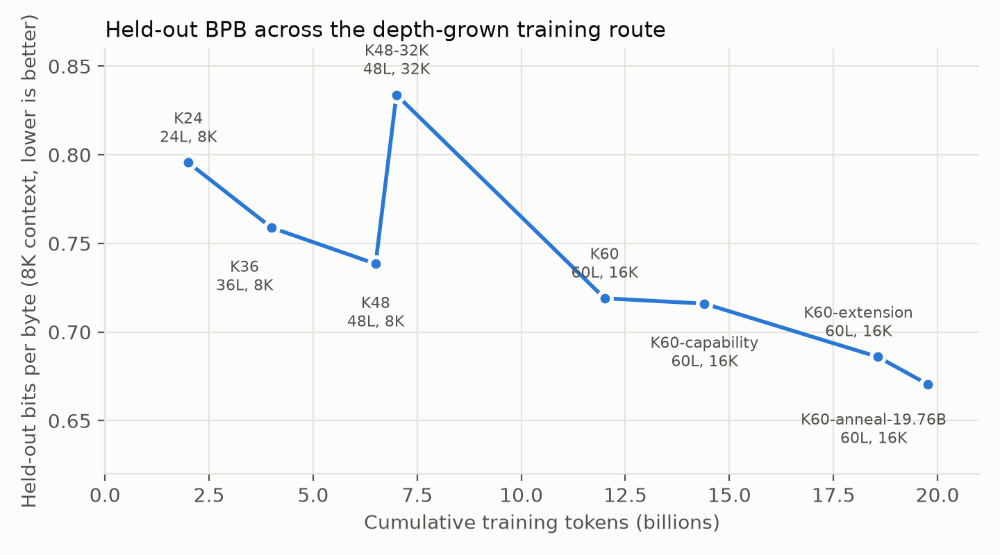
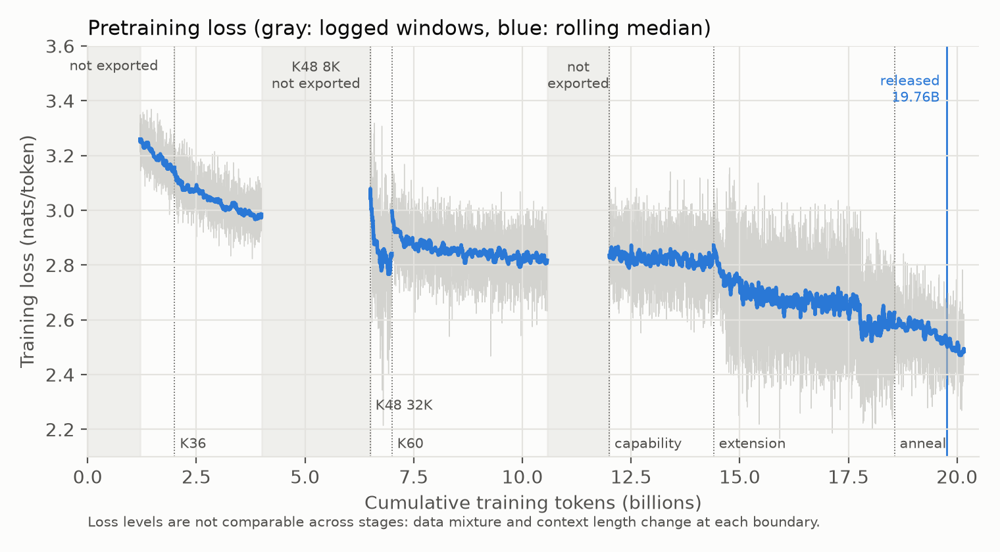

# Training Yunmo-Next-1B

*Technical report · Yunmo-Next-1B · October 2026*

## Summary

Yunmo-Next-1B was pretrained for 19.76B tokens on one GPU at a time. Training started from a 24-layer,
443M-parameter model and added 12 layers three times, reaching 60 layers and 1.008B parameters after 7B
tokens. Context length went 8K → 32K → 16K. About 10.3B tokens were trained on an RTX 4070 Ti (12 GB) and
about 9.4B on a rented RTX 5090. The 60-layer model trains at 16K context on the 12 GB card at 3,900
tokens/s with 9.8 GB peak memory.

## 1. Route

| Stage | Layers | Params | Context | Tokens | Cumulative | GPU | Updates (cumulative) | Held-out BPB |
|---|---:|---:|---:|---:|---:|---|---:|---:|
| K24 | 24 | 443.5M | 8K | 2.000B | 2.000B | 4070 Ti | 32,959 | 0.7956 |
| K36 | 36 | 631.7M | 8K | 2.000B | 4.000B | 4070 Ti | 63,477 | 0.7589 |
| K48 | 48 | 819.9M | 8K | 2.500B | 6.500B | 5090 | — | 0.7385 |
| K48 long context | 48 | 819.9M | 32K | 0.500B | 7.000B | 5090 | 109,253 | 0.8339 |
| K60 | 60 | 1,008.1M | 16K | 5.000B | 12.000B | 5090 | — | 0.7190 |
| K60 capability mixture | 60 | 1,008.1M | 16K | 2.400B | 14.400B | 5090 → 4070 Ti | 222,168 | 0.7160 |
| K60 extension | 60 | 1,008.1M | 16K | 4.161B | 18.561B | 4070 Ti | 285,661 | 0.6860 |
| K60 anneal (released) | 60 | 1,008.1M | 16K | 1.200B | 19.761B | 4070 Ti | 303,972 | 0.6706 |

Held-out BPB is measured at 8K context on the same 125 documents from 16 strata (1,023,044 scored tokens,
3,691,678 bytes) at every stage. The capability stage moved from the 5090 to the 4070 Ti at 13.41B tokens.
Token counts are packed input tokens; supervised targets are slightly fewer because cross-document targets
are masked.

### 1.1 Stage-to-stage change

Paired relative BPB change on the held-out documents with 95% intervals from a 10,000-sample document
bootstrap:

| Transition | Δ BPB | 95% interval |
|---|---:|---|
| K24 → K36 | −4.61% | [−4.83, −4.40] |
| K36 → K48 (8K) | −2.69% | [−2.87, −2.52] |
| K48 8K → K48 32K | **+12.92%** | [+11.98, +13.81] |
| K48 32K → K60 | −13.77% | [−14.51, −13.01] |
| K60 → capability | −0.42% | [−0.64, −0.21] |
| extension end → 20.16B (anneal end) | −3.00% | [−3.18, −2.83] |
| 19.76B (released) → 20.16B | −0.77% | [−0.89, −0.66] |

These intervals describe sampling over held-out documents for one training run. They are not
seed-to-seed uncertainty; the route was trained once.

### 1.2 The 32K detour

The 48-layer model was continued on 0.5B tokens of a pack built from documents long enough to fill 32K
(general web 64%, books 19%). Short-context held-out BPB rose by 12.9% while synthetic retrieval signals at
long range improved. The following 60-layer stage, back on the broad mixture at 16K, recovered the loss and
finished 2.6% below the 48-layer 8K checkpoint. Long-context retrieval in the released model is still weak
beyond 8K (see the evaluation report); the detour did not produce durable 32K capability.

## 2. Depth growth

### 2.1 Mapping

Growth from `L` to `L + 12` layers copies all existing layers, their depth routers and their optimizer state
unchanged and appends 12 new layers initialized from the first three cells of the source model; for K48 →
K60 the target layers are drawn from source layers `[0, …, 47] + [0, …, 11]`. Because each cell has the same
internal phase layout (GQA first, cell-phase MLP widths), copying whole cells keeps every tensor shape valid.
The new model is not function-preserving: the copied cells change the network's output immediately.

Each growth step first writes a mapping checkpoint with no optimizer update, evaluates it on the held-out
set, then reloads, updates once and resumes before the stage proper starts.

### 2.2 Cost of growth

| Growth | Parent BPB | Right after mapping | Recovery |
|---|---:|---:|---|
| K36 → K48 | 0.7589 | 0.7594 (+0.06%, interval [+0.05, +0.07]%) | negligible damage |
| K48 32K → K60 | 0.8339 | 0.8370 (probe) | 0.7752 after 256 updates (16.8M tokens) in a separate probe |

The K60 numbers come from a recovery probe that preceded the formal stage, not from the formal run's own
logs. No experiment compared depth growth against training a 60-layer model from scratch for the same number
of tokens, so this report makes no claim that growth is more efficient than direct training. What the
route does show is that each growth step cost little held-out quality and the deeper model kept improving.

## 3. Objective, batch and packing

- Causal next-token cross-entropy over packed rows of fixed length (8,192, 32,768 or 16,384 tokens).
- Documents carry explicit boundaries (`cu_seqlens`): attention masks, KDA recurrent state and position IDs
  reset at every boundary, and targets that would cross a boundary are excluded from the loss.
- Every optimizer update is 65,536 tokens. Micro-batch and gradient accumulation vary with context (for
  example 2 × 4 at 8K on the 4070 Ti, 1 × 4 at 16K) so the update size never changes.

**Batch size.** At 24 layers and an equal token budget early in training, updates of 262,144 and 1,048,576
tokens gained only 3.6% and 4.6% throughput over 65,536 and reached 24% and 31% worse validation BPB. The
batch was fixed at 65,536 for the whole route. This screen measured a very early regime (validation BPB
3.8–5.0); it shows that larger batches did not pay off then, not that 65,536 remains optimal at 20B tokens.

## 4. Optimizer

Parameters are assigned to optimizers by role:

| Parameters | Optimizer |
|---|---|
| SwiGLU up and gate projections | U-NorMuon |
| KDA query, key and value projections | Muon, Newton–Schulz run separately for each of the 8 heads |
| other 2-D weight matrices | Muon with neutral-centered, reliability-scaled momentum redistribution (RS-MR) |
| embeddings, norms, biases, scalars, router queries, Cell-Echo biases | AdamW |

Muon and AdamW share one base learning rate. Muon matrices use weight decay 0.1; AdamW parameters use none.

### 4.1 Evidence for the optimizer choices

Short paired runs at 24 layers, final validation loss difference (candidate minus control, nats/token):

| Choice | Seed 17 | Seed 29 |
|---|---:|---:|
| Equal Muon/AdamW learning rate vs higher Muon learning rate | −0.379 | −0.367 |
| Per-head Newton–Schulz for KDA Q/K/V vs whole-matrix | −0.028 | −0.025 |
| U-NorMuon for SwiGLU up/gate | −0.0053 | −0.0073 |
| Neutral-centered RS-MR | −0.0017 | −0.0163 |
| *Rejected:* fused RS-MR | +0.055 | — |

The equal-learning-rate result is large because the earlier recipe gave Muon a much higher learning rate;
it shows that pairing was harmful, not that 3×10⁻⁴ is optimal.

### 4.2 Schedule

| Stage | Learning rate |
|---|---|
| K24 – K60 capability | 3×10⁻⁴, with a single 160M-token warmup at the start of K24 |
| Extension | 1×10⁻⁴ constant |
| Anneal | cosine from 1×10⁻⁴ toward 3×10⁻⁵; the released checkpoint is part-way down |

The extension learning rate came from a three-arm screen from the 14.4B checkpoint:

| Extension LR | Δ broad held-out BPB [95% interval] |
|---|---|
| 3×10⁻⁵ | −1.34% [−1.38, −1.30] |
| **1×10⁻⁴ (chosen)** | **−1.63% [−1.69, −1.58]** |
| 3×10⁻⁴ | +0.28% [+0.17, +0.39] |

Keeping 3×10⁻⁴ would have improved the newly added sources while making broad held-out BPB worse.

## 5. Precision and memory

- BF16 weights, activations and main optimizer states. Losses, normalization statistics and reductions run
  in FP32. There are no FP32 master weights; Muon momentum carries FP16 Kahan compensation so updates smaller
  than the BF16 spacing still accumulate.
- Per-layer activation recomputation; the depth router materializes block keys once and recomputes them per
  block in the backward pass.
- For 32K the MLP ran in sequence chunks and Muon state was streamed between GPU and pinned host memory; a
  capacity probe of that configuration on the 4070 Ti measured 3,646 tokens/s at 9.5 GB peak. The formal
  32K stage itself ran on the 5090.

| Stage (GPU) | Micro-batch × accumulation | Median throughput | Peak reserved | MFU (6N lower bound) |
|---|---|---:|---:|---:|
| K24, 8K (4070 Ti) | — | 9,595 tok/s | 8.6 GB | 31.8% |
| K36, 8K (4070 Ti) | 2 × 4 | 6,705 tok/s | 9.4 GB | 31.7% |
| K48, 32K (5090) | 2 × 1 | 8,511 tok/s | 16.7 GB | — |
| K60, 16K (5090) | 4 × 1 | 11,320 tok/s | 24.4 GB | — |
| K60 extension, 16K (4070 Ti) | 1 × 4 | 3,924 tok/s | 9.8 GB | 29.6% |
| K60 anneal, 16K (4070 Ti) | 1 × 4 | 3,891 tok/s | 9.8 GB | 29.4% |

MFU counts 6N FLOPs per token and ignores attention, recurrence and recomputation, so it understates the
work done. It is not reported for the 5090 because no peak-throughput denominator was recorded for that card.

## 6. Data repetition at the end of training

The extension and anneal both drew from one 16K pack of 206,155 rows (3.378B tokens). The extension used
4.161B tokens, so it began a second pass over the pack at 17.78B cumulative tokens; training loss drops by
about 0.1 nats at exactly that point (figure below). The anneal drew a further 1.2B tokens from the same
pack before the released checkpoint. In total the released model saw that pack about 1.59 times.

The training-loss drop is the model meeting data it has seen before; it is not evidence of better
generalization. Held-out BPB, which uses documents outside the training data, improved through the extension
(0.716 → 0.686), and those held-out numbers are the ones this report relies on.

Training-loss levels also shift at every stage boundary because the data mixture and context length change,
so they cannot be compared across stages. Logs for the first 1.2B tokens of K24, all of K48 8K, and the
10.57–12.0B span of K60 were not exported and are left blank in the figure.

## 7. Reliability

Training ran as a sequence of resumable processes. Every checkpoint stores model weights, all optimizer
states including Kahan buffers, learning-rate state, every RNG state, step, token and micro-step counters,
the data cursor and the identity of the input data, with a SHA-256 sidecar. Resume restores the exact data
position. Same-stage resume was exercised across machines with a 6.2 GB checkpoint when the capability stage
moved from the 5090 to the 4070 Ti.

The route did hit faults, including a CUDA "device not ready" error during a KDA backward pass and an
allocator memory-ceiling stop in the extension stage; each was resumed from the last checkpoint.

## 8. Limitations

- One training run. No stage, growth step or optimizer setting was repeated with another seed at full
  scale; intervals in §1.1 are over held-out documents only.
- No comparison against training a 60-layer model from scratch, so the efficiency of growth is not
  established.
- Hardware, data mixture, context length and learning rate changed together at several boundaries; changes
  in held-out BPB cannot be attributed to one of them.
- Optimizer evidence comes from 24-layer short runs.
- About 1.59 passes over the final pack; the extension and anneal are not single-epoch.
- Some per-step logs were not exported (§6).
